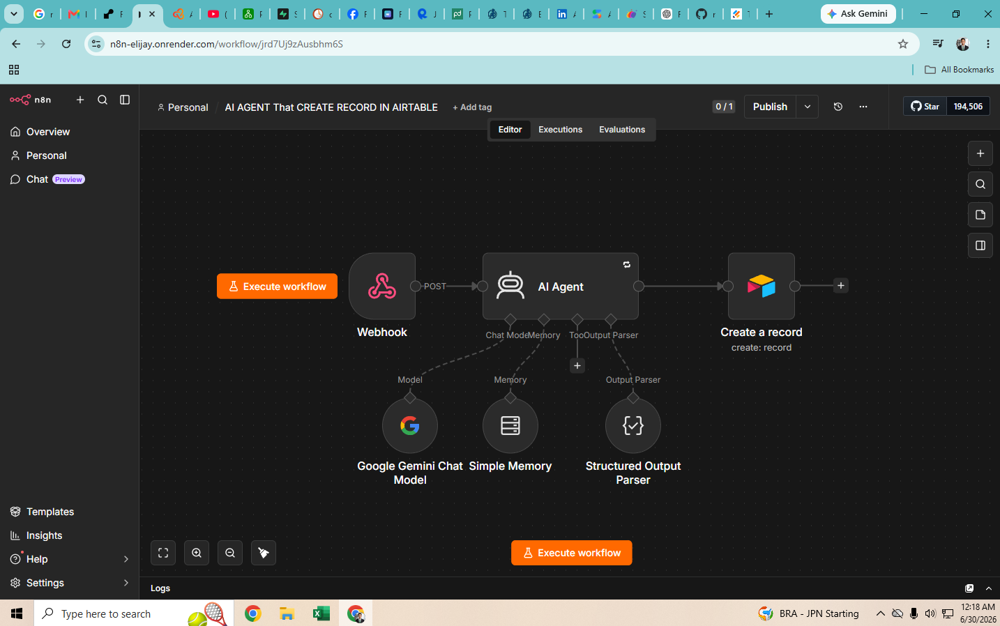
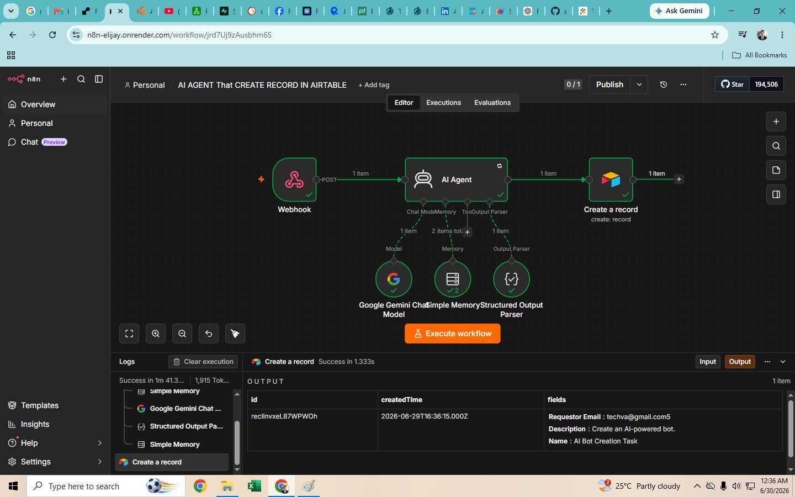
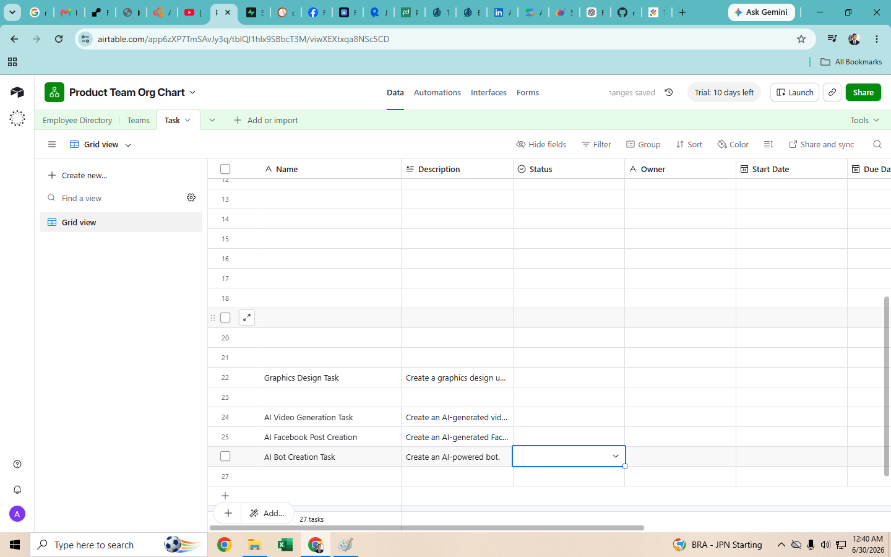

# Screenshots

## Workflow

## Successful Execution

## Airtable Result

# AI Agent Automation
---
## What it does
-This workflow automatically creates a record in airtable using n8n and the Gemini API.
Features:
- Uses AI to generate Task Names based on task details
- Automatically creates a record in airtable when provided with data using Webhook
---
## Workflow
Webhook
    │
    ▼
AI Agent
 ├── Google Gemini Chat Model
 ├── Simple Memory
 └── Structured Output Parser
    │
    ▼
Create a Record (Airtable)
---
## Required Credentials
- Airtable Personal Access Token
- Gemini API Key
---
## Setup
Prerequisites
You'll need:
✅ n8n (Cloud or Self-hosted)
✅ Google AI Studio API Key (Gemini)
✅ Airtable account
✅ Airtable Base with a table
Step 1. Create an Airtable Base
Step 2. Get Airtable API Credentials
Step 3. Create Gemini API Key
Step 4. Create a New Workflow
Step 5. Add Webhook
Step 6. Add AI Agent
Step 7. Configure Gemini
Step 8. Add Memory
Step 9. Add Structured Output Parser
Step 10. Configure the AI Prompt
Step 11. Add Airtable Node
Step 12. Test It

---
## Tools
- n8n
- Google Gemini
- Jotform
- Github
- Airtable
- Render
- Supabase
